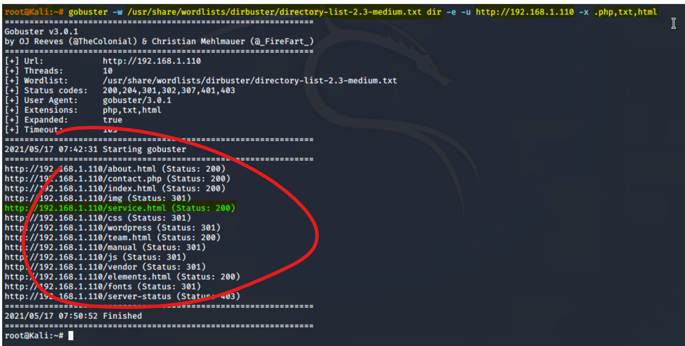

## Executive Summary

- This project is about a **Network** consisting of two servers, a penetration testing Kali VM and an ELK stack server. In addition there is also a capstone machine that is used to test for alerts. The Network architechture is presented below:

- Initially, **Blue Team Defenses** are configured in **Kibana** to generate alerts in the setting of an attack, while analyzing 'beats' (filebeat, packetbeat, metricbeat) received from an ELK Stack server

- The two servers (Target 1, Target 2) are vulnerable and a **Red Team Penetration Testing** with Kali VM is performed to attack these two targets using the principles of engagement 
    - Information gathering
    - Scanning and enumeration
    - Exploitation
    - Post-Exploitation
    - Reporting

- While the Red Team Peneteration Attacks are in operation, the **Kibana software is monitored** in live stream to test the efficacy of Blue Team Defenses in setting off appropriate alarms

- With all the new information about system wulnerabilities, a final **Purple Team Hardening** is performed against the vulnerabilities discovered during the Red Team penetration testing and the weaknesses identified in the Blue Team Defenses

## Blue Team Defenses : Initial Kibana Alerts Setup

- The network is configured behind a jumb-box and a firewall in defense against the external traffic

- All alerts are configured using the Kibana Software in ELK Stack `192.168.1.100:5601`

- Three alerts were configured to alert SOC Analysts to detect suspicious activity conerning for a potential attack, which are then tested during the red team penetration testing phase. To prevent false positives and negatives I have chosen a threshold to be above 400 in the past 5 minutes

1. Configuring alert for alarm when there are an abnormally high number of HTTP errors, as can be the case in the setting of brute force attacks when the hackers may attempt to crack logins. Note that the indices to query here is defined as `packetbeat` as thats where the http data comes from by default in ELK stack

2. Configuring an alert for an alarm when an abnormally high number of bytes have occurred as this can indicate an event of unusual data transfer in the mist of an attack. ote that the indices to query here is defined as `packetbeat` as thats where the http data comes from by default in ELK stack

 

3. Configuring an alert for alarm when CPU usage spikes to greater than 50%, such unusual heavy usage can be a marker of an attack and warrants investigation / mitigation. Note that the indices to query here is defined as `metricbeat` as thats where the CPU data comes from by default in ELK stack

 

- Below is the summary page of all three alerts

 

- Once the alerts have been configured. An index pattern is then defined to "watcher_history", this is in essence a standardized format in which the discover queries will present results

 
 

- Then finally, specifying the index pattern of "watcher_history" in discover

 

## Red Team Penetration Testing - Using Kali VM

### `1) Information Gathering`

- `ifconfig` to reveal the Kali VM Ip address and the Network range. This informs us that the Kali VM IP address is: `192.168.1.90`. We also learn about the network ranges as the netmask is 255.255.255.0 which means that only the last 8 bits are variable for the range of IP addresses and using the broadcast (the last IP) of `192.168.1.255` we can deduce the range to be `192.168.1.255/16`

 

- `netdiscover -r 192.168.1.255/16` reveals the additional IP addresses in the network such as
    - **Target 1:** `192.168.1.110`
    - **Target 2:** `192.168.1.115`
    - **ELK Stack:** `192.168.1.100` This we already know from when we configured alerts in Kibana
    - **Capstone:** `192.168.1.105` We can confirm that this is capstone by checking hyper V or accessing the terminal in Capstone and using ifconfig
    - **Gateway:** `192.168.1.1` This is usually a default IP for gateways/routers

- This information was used to create the network diagram above

 

### `2) Scanning and Enumeration`

Getting information about open ports using nmap for all hosts in the range of IP addresses of the targets

- `nmap -sV 192.168.1.110-115` Note that the range 110-115 is specified, this contains Target 1, Target 2 and ELK stack - so that the scan is completed faster

 

- The results are similar for both target 1 and target 2. The OS version Apache:

- Both have open ports 80 and 22 which can be exploited

- Both are running Apache 2.4.10 httpd on the http port and Samba smbd 3 on ports 139 and 445

- Finding out the File directory structure, open ports and IP addresses

- `nmap  -sS -A 192.168.1.110`

- Finding directories link to the website. You can use `gobuster` - more convenient; or `dirbuster`, dirbuster is more detailed if you really want to look for all the files on the network specifically

- To install gobuster run `apt-get install gobuster` - add `sudo` if not the root user, as shown below

- **`gobuster -w /usr/share/wordlists/dirbuster/directory-list-2.3-medium dir -e -u http://192.168.1.110 -x .php,txt,html`**

- Some useful gobuster flags:

- `-w` to reference wordlist
- `-e` to display expanded mode
- `-x` for file extensions
- `dir` for directories 
- `-u` for URL or domain

- I found [**This Link**](https://kalilinuxtutorials.com/gobuster/) about gobuster helpful, so I am referencing it here. It has detaliled information about all the various flags and modes

 

- Using `wpscan` can help provide information regarding potential users and vulnerabiliteis in wordpress

- `wpscan --url http://192.168.1.110/wordpress -eu` This will reveal the users

 
 

### `3) Exploitation Phase I - Hacking Target 1 VM`

- As we know that the ssh ports are open so we can SSH to Michael's account

- `ssh michael@192.168.1.10` reveals that it requires a password. We can use hydra to brute force it while attempting to connect to SSH

> ### Important word lists for password cracking

- It is helpful to know where sample wordlist are in Kali Linux. While working on this project I have learnt that there are at least 3 reference lists that every cybersecurity expert should be familiar with. These lists are composed of commonly used passwords

**1. `ls /usr//share/wordlists/rockyou.txt`**

**2. `ls /usr/share/john/password.lst`**

**3.`ls /usr/share/wordlists/dirbuster/directory-list-2.3-medium.txt`** Here the dirbuster directory contains multiple lists, but medium one shown here is just one of the many options

> ### Hydra 

- **`hydra -l michael -P /usr/share/wordlists/rockyou.txt ssh://192.168.1.110 -t 4`** Here we can also type just the ip alone followed by ssh like: `192.168.1.110 ssh` its equal to `ssh://192.168.1.110`, `-l` is for login, `-P` is for password an `t 4` is the speed. Note that if you do not specify ssh then it will brute force on port 80 which is meant for http and will be incorrect

- I found [**This Link about Hydra**](https://www.linuxfordevices.com/tutorials/linux/hydra-brute-force-ssh) helpful, and so I am sharing it as reference

- `ssh michael@192.168.1.10` for connecting

- After login some basic commands can be run for navigation

- `ifconfig`, or `ls`, `pwd` if there is shell

- At this point you can also search for the files containing the name flag `find -name flag2.txt 2>dev/null` (the `2>dev/null` instructs to not show erros of permission denied) or `find -type f -iname ‘flag*’`

 

- This informs me that there is a second flag in the directory `var/www/html`. Even if you do not use find, you can manually explore local directories by hit and trial. The flags usually are like "destination" points leading you towrds the final goal. So obviously, this flag's location shortlists where to look for it further. 

 

> ### Accessing the MySQL database using the root user

- Note that `/var/www/html` is the default root folder of a web server and if you want to access confidential files holding credentials for the MySQL server. This default folder is configured in `apache.config` file

- `wp-config.php` is one of the core files in the wordpress folder that contains information about the databases, such as root user access username and password

- You can check whether the file exists w/o navigating, simply by using ls: `ls /var/www/html/wordpress/wp-config.php`

- And then you can also direcrly visualize it w/o navigating into the directory `cat /var/www/html/wordpress/wp-config.php`

 

- `wp-config.php` contains confidential information regarding the passwords to access 

- This reveals the password for root access to the MySQL database along with the root user that has access to it

 

- Now you can type `mysql -u root -p` in the terminal to log in to mysql and then typing the password

 

- After gaining access into the MYSQL server further information can be gathered by typing the following commands

- `show databases;` to list all the current databases on MySQL server. Note that it is important to use `;` after MySQL commands

- Before you can see what tables are inside a database, that specific database name should be invoked. For example here I am interested in looking at the wordpress database which is likely to contain usernmes and their hashes

- `use wordpress;`
- `show tables;` Once the database is invoked you can look at what tables are in it

 

- `select * from wp_users;` Then you can query a specific table to display its contents. Here I am interested in looking at the users (along with hashes) that have access to the database

 

- Likewise inspection of additional tables revealed that the table `wp_posts` actually contains flags 3 and 4

- `select * from wp_posts;` 

 
 

- With the new information gathered, the hashes of the usernames can be accessed and copied into a text file for use by `John the Ripper`

- `nano michael-steven_hashes.txt`

- Once the passwords have been hacked. You can now login as Steven via SSH while I am still using the terminal for of the user `michael` on target 1. While working on this I realized that I cannot use `michael`s account to crack Steven's hash as the user did not have writing privilidges. So you can either go back and obtain root access or 

- `ssh steven@192.168.1.110`

- Then you can attempt to acquire root access with `python.spawn`

-  `sudo python -c ‘import pty;pty.spawn(“/bin/bash”);’` and find flag 4. This code line is very useful and uses python to switch the terminal priviliges to the root from the current user

 