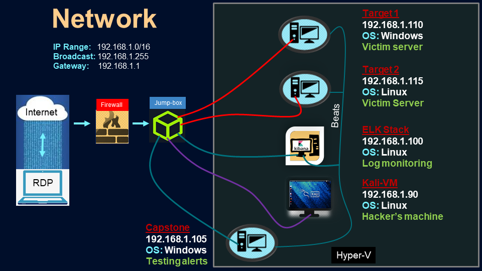

# Blue Team: Summary of Operations

## Table of Contents
- Network Topology
- Description of Targets
- Monitoring the Targets
- Patterns of Traffic & Behavior
- Suggestions for Going Further

### Network Topology

The following machines were identified on the network:
- Name of VM 1, hostname: `target1`
  - **Operating System**: nmap scan with -A flag revealed the OS to be Windows 6.1 (Samba 4.3.14-Debian)
  - **Purpose**: This is a webserver hosting MySQL databases, no write or sudo privilidges
  - **IP Address**: `192.168.1.110`
- Name of VM 2, hostname: `target2` 
  - **Operating System**: Windows 6.1 (Samba 4.3.14-Debian)
  - **Purpose**: Webserver with write and sudo previlidiges
  - **IP Address**: `192.168.1.115`

  More details about the topology can be seen in the diagram below, but in summary the Targets 1 and 2 are webservers that are to be configured for system hardening by the Blue team. The Kali VM is the penetration testing machine that will attack the targets to uncover vulnerabilities. ELK-Stack is the VM configured for receiving beats from the targets to determine whether the alerts are working effectively for their intended purposes. Finally, Capstone is another VM designed to test alerts

  

### Description of Targets

The target of this attack was: `Target 1` (192.168.110).

Target 1 is an Apache web server and has SSH enabled, so ports 80 and 22 are possible ports of entry for attackers. As such, the following alerts have been implemented:

### Monitoring the Targets

Traffic to these services should be carefully monitored. To this end, we have implemented the alerts below:

#### Alert 1:  Excessive HTTP Errors

This alert is implemented as follows:

  - **Metric**: HTTP Errors / http.response.body.bytes
  - **Threshold**: Above 400 for the last 5 minutes
  - **Vulnerability Mitigated**: Identification of Brute Force Attacks
  - **Reliability**: High reliability. Yes, I simultaneously checked while attacking, the alerts were triggered multiple times, but since they were not tied to any response action, no mitigation was performed. I consider this alert to be reliable with acceptable false positives. They were triggered during brute force attacks. 

#### Alert 2: HTTP Request Size Monitor

This alert is implemented as follows:

  - **Metric**: http.request.bytes
  - **Threshold**: Above 3500kb for the last minute
  - **Vulnerability Mitigated**: Identification of Denial of Service Attacks
  - **Reliability**: High, similar to as described above

#### Alert 3: CPU Usage Monitor

This alert is implemented as follows:

  - **Metric**: system.process.cpu.total.pct
  - **Threshold**: Above 50% CPU usage for the last 5 minutes
  - **Vulnerability Mitigated**: Detection of malacious script overwhelming the system, Resource management
  - **Reliability**: Medium, was not triggered as often. It is highly variable and relatively non-specific, but can prove to be an effective tool when used in conjuction with other alerts

## Suggestions for Going Further (Optional)

- Each alert above pertains to a specific vulnerability/exploit. Recall that alerts only detect malicious behavior, but do not stop it. For each vulnerability/exploit identified by the alerts above, suggest a patch. E.g., implementing a blocklist is an effective tactic against brute-force attacks. It is not necessary to explain _how_ to implement each patch.

The logs and alerts generated during the assessment suggest that this network is susceptible to several active threats, identified by the alerts above. In addition to watching for occurrences of such threats, the network should be hardened against them. The Blue Team suggests that IT implement the fixes below to protect the network:

### Vulnerability 1: HTTP Errors

  - **Patch**: Prevent against Brute Force attacks by blocking suspiscious IPs E.g., _install `SSHGuard` with `apt-get install sshguard`_
  - **Why It Works**: `SSHGuard` It uses logging activity to identify users with multiple failed attempts and then temporarily blocks them by putting their ip address in iptables. After a set duration the lock is automatically released. An alternative to `SSHGuard` is `Fail2Ban` package

### Vulnerability 2: Unreasonable HTTP request size

  - **Patch**: Prevent DOS attacks that exploit Linux vulnerabilities by keeping Linux Security Patches/Kernel up to date E.g., _install `Upgrade kernel` with `apt-get upgrade linux-image-generic` if Ubuntu or `apt-get upgrade kernel`, then `reboot`, this can be used in conjunction with another package `kexec`, `apt-get install kexec tools` to facilitate quicker reboots
  - **Why It Works**: It upgrades the OS with the latest security packages to prevent exploitation of vulnerabilities from an outdated software 

- Vulnerability 3
  - **Patch**: Limit excessive CPU use by a process by setting limits E.g., _install `cpulimit` with `apt-get install cpulimit`_
  - **Why It Works**: It can set limits on the CPU usage that is found to be consuming excessive CPU by using `top`. It can work in conjunction with the alert. For instance when an alert if fired for CPU usage of more than 50%, SOC analyst is informed, in response the analyst can detect which process is consuming excessive CPU by using top and then set a limit on it by using `cpulimit`. Likewise limits can also be set as default for certain processes.
